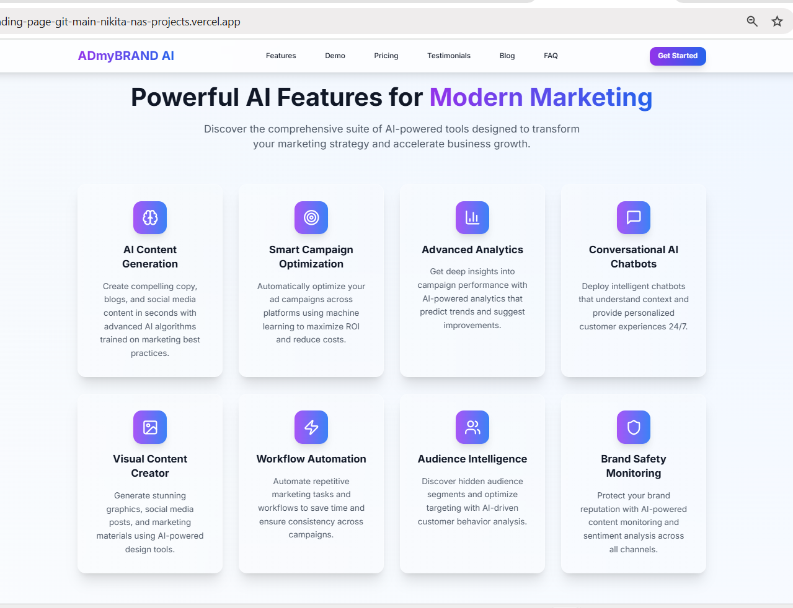
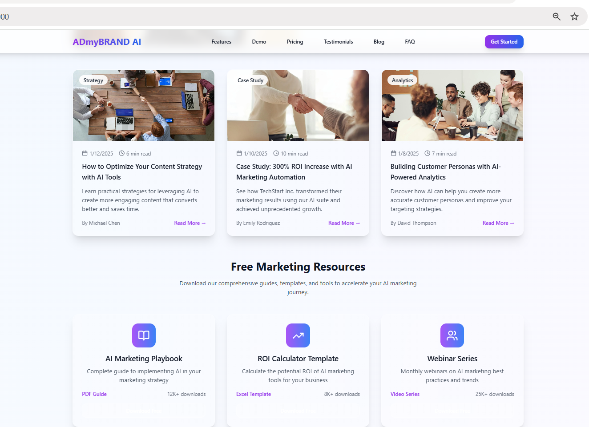

# ADmyBRAND AI Suite - Modern SaaS Landing Page

A stunning, production-ready landing page for ADmyBRAND AI Suite featuring modern design trends, smooth animations, and a comprehensive component library.

##  Features

### Landing Page Sections
- **Hero Section** - Compelling headline with gradient backgrounds and call-to-action
- **Features Section** - 8 AI-powered capabilities with interactive cards
- **Demo Section** - Interactive video player with feature demonstrations (video streamed from [Google Drive](https://drive.google.com/file/d/1KfV6s3w_BWYVEFfP-0oEFCBknAX1g4eR/view?usp=sharing))
- **Pricing Section** - 3-tier pricing with feature comparisons and highlighting
- **Interactive Pricing Calculator** - Real-time pricing customization tool
- **Testimonials Carousel** - Customer reviews with auto-rotation and navigation
- **Blog & Resources Section** - Latest insights and downloadable resources
- **FAQ Section** - Collapsible questions with smooth animations
- **Contact Form** - Validated contact form with real-time error handling
- **Footer** - Comprehensive links, social media, and newsletter signup

### UI/UX Design (2025 Trends)
- **Glassmorphism Effects** - Backdrop blur with transparency and subtle borders
- **Enhanced Glass Variants** - Multiple glassmorphism styles with improved depth
- **Smooth Animations** - Framer Motion powered interactions and transitions
- **Advanced Micro-interactions** - Hover effects, floating elements, and state changes
- **Modern Typography** - Perfect hierarchy with Inter font family
- **Gradient Backgrounds** - Purple to blue gradients with dynamic effects
- **Mesh Gradients** - Complex multi-point gradient backgrounds
- **Mobile-First Responsive** - Optimized for all device sizes
- **8px Grid System** - Consistent spacing throughout the design
- **Professional Color Psychology** - Trust-building color schemes

### Component Library
- `GlassCard` - Reusable glassmorphism card component
- `PricingCalculator` - Interactive pricing calculation tool
- `AnimatedButton` - Multi-variant button with hover animations
- `FeatureCard` - Feature showcase with icons and descriptions
- `PricingCard` - Pricing tier with feature lists and highlighting
- `TestimonialCard` - Customer review with ratings and avatars
- `FAQItem` - Collapsible question/answer component
- `BlogCard` - Blog post display with metadata and excerpts
- Plus additional form inputs and layout components

### Technical Implementation
- **Next.js 14** - App Router with TypeScript
- **Tailwind CSS** - Utility-first styling with custom design system
- **Framer Motion** - Advanced animations and transitions
- **Form Validation** - Real-time validation with error handling
- **Performance Optimized** - Fast loading with image optimization
- **SEO Ready** - Comprehensive meta tags and structure

### Bonus Features Implemented
- **Interactive Pricing Calculator** - Real-time pricing with feature selection
- **Demo Video Section** - Interactive video player with feature highlights
- **Blog & Resources Section** - Content marketing and downloadable resources
- **Advanced Animations** - Complex Framer Motion animations and transitions
- **Enhanced Glassmorphism** - Multiple glass effect variants
- **Floating UI Elements** - Dynamic positioning and animations
- **Line Clamp Utilities** - Text truncation for consistent layouts
- **Custom Slider Styling** - Branded range input components

### Preview of the Landing Page





##  Getting Started

### Prerequisites
- Node.js 18+ 
- npm or yarn

### Installation

1. Clone the repository:
```bash
git clone https://github.com/Nikita-NA/modern-saas-landing-page.git
cd admybrand-ai-landing
```

2. Install dependencies:
```bash
npm install
```

3. Run the development server:
```bash
npm run dev
```

4. Open [http://localhost:3000](http://localhost:3000) in your browser.

## Design System

### Colors
- **Primary**: Purple (#8B5CF6) to Blue (#3B82F6) gradients
- **Secondary**: Teal accents (#06B6D4)
- **Neutral**: Gray scale for text and backgrounds
- **Glass**: White with opacity and backdrop blur

### Typography
- **Font Family**: Inter (Google Fonts)
- **Hierarchy**: 5xl/4xl headings, xl/lg subheadings, base body text
- **Weights**: Bold (700), Semibold (600), Medium (500), Regular (400)

### Spacing
- **System**: 8px base unit (0.5rem)
- **Components**: Consistent padding and margins
- **Layout**: Max-width containers with responsive breakpoints

## Responsive Breakpoints

- **Mobile**: < 768px
- **Tablet**: 768px - 1024px  
- **Desktop**: > 1024px
- **Large Desktop**: > 1280px

## Customization

### Adding New Sections
1. Create component in `components/sections/`
2. Import and add to `app/page.tsx`
3. Update navigation in `Header.tsx`

### Modifying Design
- Update colors in `tailwind.config.ts`
- Modify animations in component files
- Adjust spacing using Tailwind utilities

### Content Updates
- Hero content in `components/sections/Hero.tsx`
- Features data in `components/sections/Features.tsx`
- Pricing plans in `components/sections/Pricing.tsx`

## Deployment

### Build for Production
```bash
npm run build
```

### Deploy to Vercel
```bash
vercel --prod
```

### Deploy to Netlify
```bash
npm run build
# Upload dist folder to Netlify
```

##  Performance Features

- **Image Optimization** - Next.js automatic optimization
- **Code Splitting** - Automatic route-based splitting
- **Lazy Loading** - Components load when needed
- **Smooth Scrolling** - CSS and JavaScript scroll behavior
- **Optimized Fonts** - Google Fonts with display swap

##  SEO Optimization

- **Meta Tags** - Comprehensive Open Graph and Twitter cards
- **Structured Data** - Schema markup for better indexing
- **Semantic HTML** - Proper heading hierarchy and landmarks
- **Performance** - Fast loading times and Core Web Vitals
- **Accessibility** - WCAG compliant with proper focus management

##  Tech Stack

- **Frontend**: Next.js 14, React 18, TypeScript
- **Styling**: Tailwind CSS, CSS Custom Properties
- **Animations**: Framer Motion
- **Icons**: Lucide React
- **Images**: Pexels (stock photos)
- **Fonts**: Inter (Google Fonts)


## License

This project is licensed under the MIT License - see the LICENSE file for details.


---

Built with ❤️ using Next.js, Tailwind CSS, and Framer Motion.